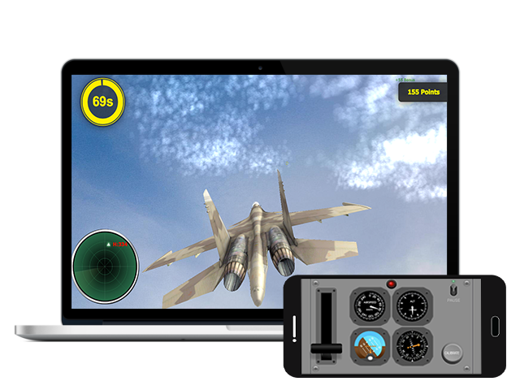

  

  

<a href="">http://gyrocraft.co.nf</a>

## What it is
Gyrocraft is an arcade-style game created to provide an immersive gameplay experience. 
By utilizing both your computer screen and handheld device, it brings you the ultimate gaming experience. 

Moving your device and looking at it simultaneously can be pretty hard we created Gyrocraft as a project in the Technion to solve that problem

## Technology
* WebGL + ThreeJS - we created a 3D game in the browser by using ThreeJS framework that use WebGL.
* Android - we developed an android app to controll the game
* WebRTC + WebSocket - the app connect to the browser with WebRTC and has a WebSocket connection as a fullback

## How to play

* Go to http://gyrocraft.co.nf
* [Download the apk](https://github.com/galprz/Gyrocraft/blob/master/final-submit/app-debug.apk?raw=true) to your Android device and install it
* In the app press play , pick a plane and scan the code that you see in the website

## Connection
We used [Skylink](https://skylink.io/) service to create a P2P connection between the browser and the android device .  
Skylink provides a simple javascript and android sdk to create fast and reliable P2P connection with WebRTC.  go to skylink website to learn more.

As a fullback we created a simple WebSocket connection the android app creates Websocket service and the browser connect to it as a client . 
In order to connect via WebSocket the browser and the app need to bee connected to the same wifi

## Videos

## Useful links

* [ThreeJS](https://threejs.org/)
* [WebRTC](https://webrtc.org/)
* [Skylink](https://skylink.io/)
